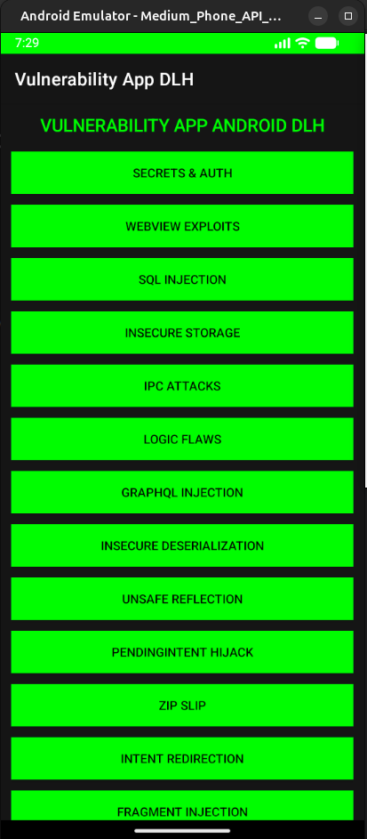

# VulnerApp Droid-LLM-Hunter

**VulnerAppDLH** is a deliberately insecure Android application designed as a **training ground** and **testbed** for the [Droid-LLM-Hunter](https://github.com/roomkangali/droid-llm-hunter) security analysis tool. It implements a wide range of common Android vulnerabilities based on the **OWASP Mobile Top 10** and **MASVS** standards, serving as a perfect target to demonstrate DLH's detection capabilities.

> **v2.0.0 — Testbed Expansion.** This release adds **8 new vulnerability classes** (Insecure Deserialization, Unsafe Reflection, PendingIntent Hijacking, Zip Slip, **Intent Redirection**, Fragment Injection, StrandHogg, Hardcoded Secrets in XML), bringing the app to **15 isolated vulnerability modules**. It is verified against Droid-LLM-Hunter's semantic golden test at **25/25 recall**. See **[Updatev2.0.0.md](Updatev2.0.0.md)** for the full changelog.

### 📚 Documentation & Verification
This repository includes detailed verification reports generated by Droid-LLM-Hunter:

*   **[🛡️ GENERATE_EXPLOIT.md](GENERATE_EXPLOIT.md)**: Contains the full list of verified vulnerabilities, mapping to report folders, and **executed exploit scripts** (Python/Shell/HTML/JS).
*   **[📘 VULNER_DLH.md](VULNER_DLH.md)**: A technical encyclopedia of all vulnerability rules supported by DLH, including technical impact, detection logic, and the **ground-truth map** (rule → file) used by the golden test.

<div align="center">

<p>
    
    
    
    
</p>

</div>

<p align="center">
  
</p>

---

## 📋 Table of Contents

- [💀 Implemented Vulnerabilities](#-implemented-vulnerabilities)
- [🛠️ Build & Installation](#️-build--installation)
- [🚀 Scanning with Droid-LLM-Hunter](#-scanning-with-droid-llm-hunter)
- [🗺️ Development Roadmap](#%EF%B8%8F-development-roadmap)
- [📝 Technical Details](#-technical-details)

---

## 💀 Implemented Vulnerabilities

VulnerApp contains the following intentional security flaws, each isolated in its own Activity for clear demonstration. Modules **1–7** are the original set; modules **8–15** were added in **v2.0.0**.

### 1. Hardcoded Secrets & Insecure Storage
*   **Component:** `SecretsActivity`
*   **Vulnerability:**
    *   Hardcoded AWS Access Keys and API Tokens in source code.
    *   Storing sensitive user credentials (plaintext) in `SharedPreferences`.
    *   Logging sensitive tokens to `Logcat`.
*   **MASVS:** MASVS-STORAGE-1, MASVS-CODE-2

### 2. SQL Injection
*   **Component:** `SQLInjectionActivity`
*   **Vulnerability:**
    *   Constructs SQL queries using raw string concatenation with user input.
    *   Allows attackers to manipulate database queries (e.g., `' OR '1'='1`).
*   **MASVS:** MASVS-CODE-4

### 3. WebView Exploits
*   **Component:** `WebViewActivity`
*   **Vulnerability:**
    *   **Cross-Site Scripting (XSS):** JavaScript enabled (`setJavaScriptEnabled(true)`).
    *   **Local File Access:** Access to file system allowed (`setAllowUniversalAccessFromFileURLs(true)`).
    *   **JavascriptInterface:** Exposes sensitive native methods (`getSecrets`) to web content — a hardcoded token bridged to JavaScript.
    *   **Deep Link:** Vulnerable to loading malicious URLs via `dlh://webview`.
*   **MASVS:** MASVS-PLATFORM-2, MASVS-CODE-4

### 4. GraphQL Injection
*   **Component:** `GraphQLInjectionActivity`
*   **Vulnerability:**
    *   Constructs GraphQL queries by concatenating user strings directly into the query body.
    *   Susceptible to query injection/mutation attacks.
*   **MASVS:** MASVS-CODE-4

### 5. Insecure File Operations
*   **Component:** `InsecureFileActivity`
*   **Vulnerability:**
    *   **World-Readable Files:** Creates files with `MODE_WORLD_READABLE` / `setReadable(true, false)` (deprecated but dangerous).
    *   **Path Traversal:** allows reading arbitrary files via unchecked user input filenames.
*   **MASVS:** MASVS-STORAGE-1, MASVS-CODE-4

### 6. Weak Cryptography & Auth Bypass
*   **Component:** `CryptoActivity`
*   **Vulnerability:**
    *   **Weak Randomness:** Uses `java.util.Random` for Session Tokens (predictable).
    *   **Auth Bypass:** Simulates biometric authentication that sets a simple boolean flag in memory (client-side trust — a logic flaw).
*   **MASVS:** MASVS-CRYPTO-1, MASVS-AUTH-1

### 7. IPC & Exported Components
*   **Component:** `UnprotectedExportedActivity`, `SpoofableReceiver`
*   **Vulnerability:**
    *   **Deep Link Hijacking:** `vulnerapp://*` accepts any host, prone to intent interception.
    *   **Intent Spoofing:** Exported Broadcast Receiver accepts actions from any app without permission checks.
*   **MASVS:** MASVS-PLATFORM-1

### 8. Insecure Deserialization 🆕
*   **Component:** `DeserializationActivity`
*   **Vulnerability:**
    *   Deserializes attacker-supplied bytes from an Intent extra via `ObjectInputStream.readObject()` with no `ObjectInputFilter`/allowlist — object injection / gadget-chain RCE.
*   **MASVS:** MASVS-CODE-4

### 9. Unsafe Reflection 🆕
*   **Component:** `ReflectionActivity`
*   **Vulnerability:**
    *   Instantiates an arbitrary class named by an untrusted Intent extra via `Class.forName(...).newInstance()`.
*   **MASVS:** MASVS-CODE-4

### 10. PendingIntent Hijacking 🆕
*   **Component:** `PendingIntentActivity`
*   **Vulnerability:**
    *   Creates a **mutable** `PendingIntent` (`FLAG_MUTABLE`) wrapping an implicit Intent — a receiving app can redirect it and act with this app's identity.
*   **MASVS:** MASVS-PLATFORM-1

### 11. Zip Slip 🆕
*   **Component:** `ZipSlipActivity`
*   **Vulnerability:**
    *   Extracts archive entries with `new File(targetDir, entry.getName())` and no canonical-path check — a `../` entry name overwrites arbitrary files.
*   **MASVS:** MASVS-CODE-4

### 12. Intent Redirection 🆕
*   **Component:** `IntentRedirectionActivity`
*   **Vulnerability:**
    *   Forwards a **nested, attacker-supplied Intent** (`getParcelableExtra`) via `startActivity()` without validation — a confused-deputy path to this app's non-exported components.
*   **MASVS:** MASVS-PLATFORM-1
*   **Note:** This module drove a **new detection rule** (`intent_redirection`) in Droid-LLM-Hunter.

### 13. Fragment Injection 🆕
*   **Component:** `FragmentInjectionActivity`
*   **Vulnerability:**
    *   An exported `PreferenceActivity` whose `isValidFragment()` returns `true` for any name — an attacker loads arbitrary fragments via `:android:show_fragment`.
*   **MASVS:** MASVS-PLATFORM-1

### 14. StrandHogg (Task Hijacking) 🆕
*   **Component:** `HijackTargetActivity` (declared in `AndroidManifest.xml`)
*   **Vulnerability:**
    *   Exported activity with a custom `android:taskAffinity` + `android:launchMode="singleTask"` — a malicious app sharing the affinity can hijack the task and overlay/phish the user.
*   **MASVS:** MASVS-PLATFORM-3

### 15. Hardcoded Secrets in Resources 🆕
*   **Component:** `res/values/strings.xml`
*   **Vulnerability:**
    *   Sensitive keys embedded in resources (`google_api_key`, `aws_secret_access_key`, `stripe_secret_key`) — trivially extractable from `resources.arsc`.
*   **MASVS:** MASVS-STORAGE-2

---

## 🛠️ Build & Installation

You need a **JDK 17** and **Gradle 8.x** (or Android Studio). The project uses the Android Gradle Plugin 8.2 (`compileSdk 34`), which requires JDK 17.

### 1. Build the APK
Use the Gradle wrapper to build the debug APK:

```bash
git clone https://github.com/roomkangali/VulnerAppDLH.git
cd VulnerAppDLH
./gradlew assembleDebug
```

> If your machine has no `local.properties`, point Gradle at your Android SDK:
> `echo "sdk.dir=$HOME/Android/Sdk" > local.properties`

### 2. Locate the APK
The output APK will be located at:
`app/build/outputs/apk/debug/app-debug.apk`

### 3. Install on Device/Emulator
```bash
adb install app/build/outputs/apk/debug/app-debug.apk
```

---

## 🚀 Scanning with Droid-LLM-Hunter

To analyze this app using Droid-LLM-Hunter (DLH) and verify the vulnerabilities:

### 1. Preparation
Copy the built APK into the root of `droid-llm-hunter` (the golden test expects `VulnerAppDLHv2.apk`), then enable the rules you want in `config/settings.yaml`.

### 2. Run the Scan
```bash
python3 dlh.py scan VulnerAppDLHv2.apk
```

### 3. View Results
DLH writes a JSON report to the `output/` directory. Modules exercised by this app map to rules such as:
*   `hardcoded_secrets`, `hardcoded_secrets_xml`, `insecure_storage`
*   `sql_injection`, `graphql_injection`, `path_traversal`, `zip_slip`
*   `webview_xss`, `insecure_webview`, `webview_file_access`, `webview_deeplink`
*   `insecure_random_number_generation`, `biometric_bypass`, `universal_logic_flaw`
*   `exported_components`, `intent_spoofing`, `deeplink_hijack`, `strandhogg`
*   `insecure_deserialization`, `unsafe_reflection`, `pending_intent_hijacking`, `fragment_injection`, `intent_redirection`

> **Golden test:** DLH's opt-in semantic test (`pytest -m llm`) scans this APK and asserts a **25/25 recall** contract against the ground-truth map in [VULNER_DLH.md](VULNER_DLH.md).

---

## 🗺️ Development Roadmap

### Completed in v2.0.0
*   ✅ 8 new vulnerability modules (see modules 8–15 above), including the new `intent_redirection` class co-developed with DLH.

### Future Updates
*   **Dynamic Rule Updates:** This application is updated with new vulnerability scenarios as new detection rules are added to Droid-LLM-Hunter (DLH).

### Deferred / High-Risk Features
*   **Jetpack Compose Security (`jetpack_compose_security`)** 🔴
    *   **Status:** Deferred to a **separate, dedicated Compose app**.
    *   **Reasoning:** This project deliberately stays on the standard XML ("Legacy View") system so the framework matches the original testbed. Adding Compose would require enabling `compose true` and pulling heavy Compose UI / Material3 / compiler dependencies into `build.gradle`, which is out of scope for this app.

---

## 📝 Technical Details

*   **Version:** 2.0.0 (`versionCode 2`)
*   **Package Name:** `com.dlh.vulnerapp`
*   **Min SDK:** 24
*   **Target / Compile SDK:** 34
*   **Language:** Kotlin
*   **UI:** Standard XML Views + programmatic layouts (no Jetpack Compose)

> **Disclaimer:** This application is **INTENTIONALLY VULNERABLE**. Do not install it on a production device containing sensitive data. Do not use portions of this code in real applications.
